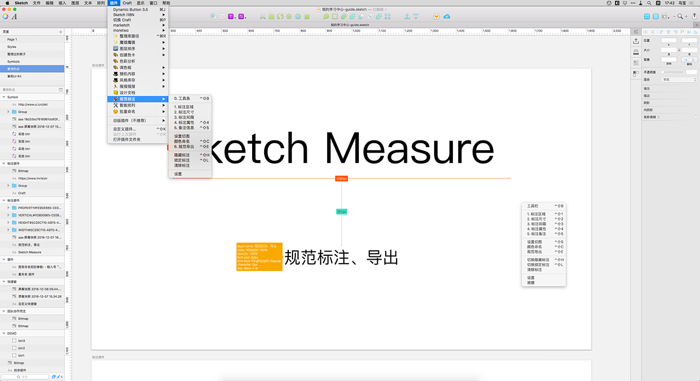

#Measure -mini-mab

###规范标注导出精简版 

20170320更新 V2.5.1－－－－－－－－－

1. 去除 artboard 缩略图
2. 修改背景色 #f8f8f8
3. 修改滚动条样式
4. 支持artboard 层级缩进（1.1 缩进1级，1.1.1缩进2级）

20161220更新 V2.3.6－－－－－－－－－

在Utom 的基础上微调了HTML模版样式,视觉设计师的修改版：

1. 去除头部黑色bar
2. 隐藏分辨率修改功能
3. 全中文支持
4. 本土化支持、全屏预览

以下是原版： 作者 @Utom －－－－－－－－－

Make it fun to create specs for developers and teammates. **Sketch 41.* support**.

- [How to](http://utom.design/measure/how-to.html)
- [中文说明](http://sketch.im/plugins/1)

#### [Sponsor me to buy a new iPhone](http://utom.design/measure/donate.html)

## Installing Plugins
1. [Download the ZIP file](https://github.com/utom/sketch-measure/archive/master.zip) and unzip
2. Open `Sketch Measure.sketchplugin`

## New UI
Friendly user interface offers you a more intuitive way of making marks.

### How to
* Hold down the `Option` key on keyboard and click icons on the toolbar to show panels.

## Spec Export
Automatically generate a html page with one click, and inspect all the design details including CSS Styles on it offline.

**If you want to create one artboard by one HTML file, please uncheck "Advanced mode".**

Demo: http://utom.design/news/

## Custom Shortcuts
To create your own custom shortcuts, go to Keyboard in your System Preferences and click the Shortcuts tab. Select App Shortcuts and click ‘+’ to create a new shortcut. Choose Sketch from the Application list, then enter the exact name of the menu item you want to create the shortcut for. Finally choose your own shortcut combination and you’re all set.

##Contributors
* Author [utom](http://utom.design)
* [SketchI18N](https://github.com/cute/SketchI18N), [cute](http://liguangming.com)
* [esseak](https://github.com/esseak)
* [mkl87](https://github.com/mkl87)
* 繁體中文（台灣) by Kai and [Zih-Hong](http://zihhonglin.com)
* And [Other](https://github.com/utom/sketch-measure/contributors)

##Contact

* Follow [@utom](http://twitter.com/utom) on Twitter
* Email <moretwo@126.com>
